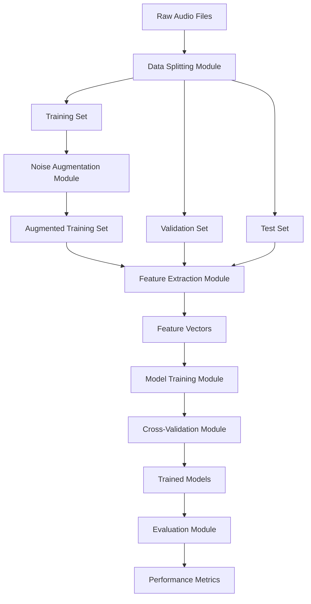

# 설계 문서

## 개요

수박 소리 분류 시스템은 오디오 녹음을 처리하여 수박의 숙성도를 분류하는 모듈형 파이썬 파이프라인으로 설계되었습니다. 시스템은 포괄적인 오디오 특징 추출을 위해 librosa를 활용하고, 소음 주입을 통한 강건한 데이터 증강을 구현하며, 머신러닝 모델 훈련 및 평가를 위해 scikit-learn을 사용합니다. 아키텍처는 데이터 누출을 방지하기 위한 적절한 파이프라인 순서를 통해 데이터 무결성을 우선시하면서 향후 모델 확장을 위한 확장성을 보장합니다.

## 데이터 아키텍처

### 디렉토리 구조
시스템은 다음과 같은 표준화된 데이터 디렉토리 구조를 사용합니다:

```
project_root/
├── data/
│   ├── raw/                   # 원본 수박 소리 파일 (이미 분할됨)
│   │   ├── train/             # 훈련용 데이터 (70%)
│   │   │   ├── watermelon_A/  # 클래스 A (예: 덜 익은 수박)
│   │   │   ├── watermelon_B/  # 클래스 B (예: 적당히 익은 수박)
│   │   │   └── watermelon_C/  # 클래스 C (예: 잘 익은 수박)
│   │   ├── validation/        # 검증용 데이터 (20%)
│   │   │   ├── watermelon_A/
│   │   │   ├── watermelon_B/
│   │   │   └── watermelon_C/
│   │   └── test/              # 테스트용 데이터 (10%)
│   │       ├── watermelon_A/
│   │       ├── watermelon_B/
│   │       └── watermelon_C/
│   ├── noise/                 # 소음 파일들
│   │   ├── environmental/     # 환경 소음
│   │   │   └── retail/        # 소매점/마트 환경 소음
│   │   │       ├── homeplus/  # 홈플러스 환경 소음
│   │   │       └── emart/     # 이마트 환경 소음
│   │   ├── mechanical/        # 기계 소음 (선택사항)
│   │   └── background/        # 배경 소음 (선택사항)
│   ├── processed/             # 처리된 데이터 (자동 생성)
│   │   ├── augmented/         # 증강된 훈련 데이터만 저장
│   │   │   ├── watermelon_A/
│   │   │   ├── watermelon_B/
│   │   │   └── watermelon_C/
│   │   ├── features/          # 추출된 특징 파일
│   │   └── splits/            # 데이터 분할 정보 (메타데이터)
│   └── models/                # 훈련된 모델 (자동 생성)
│       ├── artifacts/         # 모델 메타데이터
│       ├── pickle/            # Pickle 형식 모델
│       └── coreml/            # Core ML 형식 모델
├── src/                       # 소스 코드
├── config/                    # 구성 파일
├── logs/                      # 로그 파일
└── results/                   # 실험 결과 및 보고서
```

### 데이터 파일 명명 규칙
- **원본 파일**: `{class_name}_{sample_id}.wav` (예: watermelon_A_001.wav)
- **소음 파일**: `{location}_{type}_{id}.wav` (예: homeplus_ambient_001.wav, emart_crowd_001.wav)
- **증강 파일**: `{original_name}_aug_{noise_type}_snr{snr_value}.wav`

## 아키텍처

시스템은 명확한 관심사 분리를 가진 계층형 아키텍처를 따릅니다:



### 핵심 구성요소

1. **데이터 관리 계층**: 파일 I/O, 데이터 분할, 데이터 무결성 유지를 처리
2. **전처리 계층**: 오디오 증강 및 특징 추출을 관리
3. **머신러닝 계층**: 모델 훈련, 교차 검증, 평가를 구현
4. **유틸리티 계층**: 로깅, 검증, 구성을 위한 공통 함수 제공

## 구성요소 및 인터페이스

### 1. 오디오 특징 추출 구성요소

**목적**: librosa를 사용하여 수박 소리 녹음에서 포괄적인 오디오 특징을 추출

**인터페이스**:
```python
def extract_features(audio_file_path: str) -> np.ndarray:
    """
    단일 오디오 파일에서 포괄적인 오디오 특징을 추출합니다.
    
    Parameters:
    -----------
    audio_file_path : str
        .wav 오디오 파일의 경로
        
    Returns:
    --------
    np.ndarray
        추출된 모든 특징을 포함하는 특징 벡터
    """
```

**추출되는 특징**:
- **MFCC (Mel-Frequency Cepstral Coefficients)**: 스펙트럼 포락선을 포착하는 13개 계수
- **Mel Spectrogram 통계**: mel-scale 파워 스펙트로그램의 평균과 표준편차
- **Spectral Centroid**: 스펙트럼의 질량 중심
- **Spectral Rolloff**: 스펙트럼 에너지의 85%가 포함되는 주파수
- **Zero Crossing Rate**: 신호의 부호 변화율
- **Chroma Features**: 12차원 피치 클래스 프로파일

**구현 세부사항**:
- 일관된 샘플링 레이트를 위해 sr=22050으로 librosa.load() 사용
- 시간 해상도를 위해 hop_length=512로 윈도잉 적용
- 모든 특징을 단일 특징 벡터로 연결
- 무음 또는 손상된 오디오 파일에 대한 예외 상황 처리

### 2. 데이터 증강 구성요소

**목적**: 제어된 SNR 레벨에서 깨끗한 오디오를 다양한 소음 유형과 혼합하여 강건한 훈련 데이터 생성

**인터페이스**:
```python
def augment_noise(clean_audio_path: str, noise_files: List[str], 
                  snr_levels: List[float], output_dir: str) -> List[str]:
    """
    깨끗한 오디오의 소음 증강 버전을 생성합니다.
    
    Parameters:
    -----------
    clean_audio_path : str
        원본 깨끗한 오디오 파일의 경로
    noise_files : List[str]
        소음 오디오 파일 경로 목록
    snr_levels : List[float]
        소음 혼합을 위한 SNR 값(dB)
    output_dir : str
        증강된 오디오 파일을 저장할 디렉토리
        
    Returns:
    --------
    List[str]
        생성된 증강 오디오 파일의 경로들
    """
```

**증강 전략**:
- **SNR 제어**: 목표 SNR(dB)을 기반으로 소음 진폭을 동적으로 조정
- **소음 다양성**: 사용 가능한 모든 소음 유형 지원 (홈플러스, 이마트 환경 소음 등)
- **유연한 처리**: 소음 파일이 없는 폴더는 자동으로 건너뛰며 시스템 동작에 영향 없음
- **스케일링**: 사용 가능한 소음 파일 수에 따라 증강 샘플 수 조정
- **보존**: 원본 오디오 분류 레이블 유지

**수학적 기초**:
- SNR 계산: `SNR_dB = 20 * log10(RMS_signal / RMS_noise)`
- 소음 스케일링: `noise_scaled = noise * (RMS_signal / RMS_noise) * 10^(-SNR_dB/20)`

### 3. 데이터 파이프라인 구성요소

**목적**: 적절한 순서를 통해 데이터 흐름을 관리하고 데이터 누출을 방지

**인터페이스**:
```python
class DataPipeline:
    def __init__(self, data_dir: str = "data"):
        """데이터 디렉토리로 파이프라인을 초기화합니다."""
        self.raw_data_dir = os.path.join(data_dir, "raw")
        self.noise_dir = os.path.join(data_dir, "noise")
        self.processed_dir = os.path.join(data_dir, "processed")
        
    def load_train_data(self) -> Dict[str, List[str]]:
        """data/raw/train/ 디렉토리에서 클래스별 오디오 파일을 로드합니다."""
        
    def load_validation_data(self) -> Dict[str, List[str]]:
        """data/raw/validation/ 디렉토리에서 클래스별 오디오 파일을 로드합니다."""
        
    def load_test_data(self) -> Dict[str, List[str]]:
        """data/raw/test/ 디렉토리에서 클래스별 오디오 파일을 로드합니다."""
        
    def load_noise_files(self) -> List[str]:
        """data/noise/ 디렉토리에서 사용 가능한 소음 파일을 재귀적으로 로드합니다."""
        
    def augment_training_data(self, noise_files: List[str]) -> List[str]:
        """훈련 세트에만 증강을 적용합니다. 소음 파일이 없으면 원본 데이터만 사용합니다."""
        
    def extract_all_features(self) -> Tuple[np.ndarray, np.ndarray, np.ndarray]:
        """모든 데이터셋에서 특징을 추출합니다."""
```

**데이터 흐름 순서**:
1. **데이터 로딩**: 이미 분할된 train/validation/test 디렉토리에서 클래스별 파일 로드
2. **소음 파일 검색**: data/noise/ 하위 모든 디렉토리에서 사용 가능한 소음 파일 재귀적 탐색
3. **훈련 증강**: 사용 가능한 소음 파일이 있으면 훈련 세트에만 소음 증강 적용, 없으면 원본 데이터 사용
4. **특징 추출**: 증강된(또는 원본) 훈련, 원본 검증, 원본 테스트 세트 처리
5. **모델 훈련**: 교차 검증과 함께 처리된 훈련 특징 사용
6. **최종 평가**: 원본(비증강) 테스트 세트에서 테스트

### 4. 머신러닝 구성요소

**목적**: scikit-learn을 사용하여 분류 모델을 훈련하고 평가

**인터페이스**:
```python
class ModelTrainer:
    def __init__(self, models: Dict[str, Any]):
        """모델 구성으로 초기화합니다."""
        
    def train_with_cv(self, X_train: np.ndarray, y_train: np.ndarray, 
                      cv_folds: int = 5) -> Dict[str, Any]:
        """교차 검증으로 모델을 훈련합니다."""
        
    def evaluate_final(self, X_test: np.ndarray, y_test: np.ndarray) -> Dict[str, Dict[str, float]]:
        """테스트 세트에서 훈련된 모델을 평가합니다."""
        
    def save_models(self, output_dir: str) -> Dict[str, str]:
        """훈련된 모델을 pickle 형식으로 저장합니다."""
        
    def convert_to_coreml(self, model_path: str, output_path: str) -> str:
        """pickle 모델을 Core ML 형식으로 변환합니다."""
```

**모델 구성**:

**Support Vector Machine (SVM)**:
- 커널: RBF (Radial Basis Function)
- 하이퍼파라미터 튜닝: C (정규화)와 gamma (커널 계수)
- 교차 검증 그리드: C=[0.1, 1, 10, 100], gamma=['scale', 'auto', 0.001, 0.01]

**Random Forest**:
- 기본 추정기: 제어된 깊이의 결정 트리
- 하이퍼파라미터 튜닝: n_estimators, max_depth, min_samples_split
- 교차 검증 그리드: n_estimators=[50, 100, 200], max_depth=[None, 10, 20], min_samples_split=[2, 5, 10]

### 5. 교차 검증 구성요소

**목적**: 강건한 모델 평가를 위한 K-Fold 교차 검증 구현

**구현**:
- **K-Fold 전략**: 5-fold 교차 검증 (K=5)
- **계층화**: 폴드 간 클래스 분포 유지
- **하이퍼파라미터 최적화**: 체계적인 매개변수 튜닝을 위한 GridSearchCV
- **메트릭**: 각 폴드에 대한 정확도, 정밀도, 재현율, F1-score

**프로세스**:
1. 증강된 훈련 데이터를 5개 폴드로 분할
2. 각 하이퍼파라미터 조합에 대해:
   - 4개 폴드에서 훈련, 1개 폴드에서 검증
   - 성능 메트릭 기록
3. 평균 검증 성능을 기반으로 최적의 하이퍼파라미터 선택
4. 전체 증강된 훈련 세트에서 최종 모델 재훈련

### 6. 모델 저장 및 변환 구성요소

**목적**: 훈련된 모델을 다양한 배포 형식으로 저장 및 변환

**인터페이스**:
```python
class ModelConverter:
    def __init__(self, feature_config: Dict[str, Any]):
        """특징 구성 정보로 초기화합니다."""
        
    def save_pickle_model(self, model: Any, model_name: str, output_dir: str) -> str:
        """모델을 pickle 형식으로 저장합니다."""
        
    def convert_to_coreml(self, pickle_path: str, output_path: str, 
                         input_description: Dict[str, Any]) -> str:
        """pickle 모델을 Core ML 형식으로 변환합니다."""
        
    def create_model_metadata(self, model_info: Dict[str, Any]) -> Dict[str, Any]:
        """모델 메타데이터를 생성합니다."""
```

**변환 전략**:
- **Pickle 저장**: 모델과 전처리 파라미터를 함께 저장
- **Core ML 변환**: coremltools를 사용한 iOS/macOS 호환 형식 변환
- **메타데이터 관리**: 모델 버전, 성능 지표, 입출력 스펙 저장
- **검증**: 변환된 모델의 예측 결과 일치성 확인

## 데이터 모델

### 오디오 파일 메타데이터
```python
@dataclass
class AudioFile:
    file_path: str
    label: str  # watermelon_A, watermelon_B, watermelon_C
    split: str  # 'train', 'val', 'test'
    is_augmented: bool
    original_file: Optional[str] = None  # 증강된 파일용
    snr_level: Optional[float] = None    # 증강된 파일용
    noise_type: Optional[str] = None     # 증강된 파일용
```

### 특징 벡터 구조
```python
@dataclass
class FeatureVector:
    mfcc: np.ndarray          # 형태: (13,)
    mel_mean: float           # 스칼라
    mel_std: float            # 스칼라
    spectral_centroid: float  # 스칼라
    spectral_rolloff: float   # 스칼라
    zero_crossing_rate: float # 스칼라
    chroma: np.ndarray        # 형태: (12,)
    
    def to_array(self) -> np.ndarray:
        """ML 모델을 위해 평면 numpy 배열로 변환합니다."""
        return np.concatenate([
            self.mfcc,
            [self.mel_mean, self.mel_std, self.spectral_centroid, 
             self.spectral_rolloff, self.zero_crossing_rate],
            self.chroma
        ])  # 총 형태: (28,)
```

### 모델 성능 메트릭
```python
@dataclass
class ModelMetrics:
    accuracy: float
    precision: Dict[str, float]  # 클래스별 정밀도
    recall: Dict[str, float]     # 클래스별 재현율
    f1_score: Dict[str, float]   # 클래스별 F1-score
    confusion_matrix: np.ndarray
    cross_val_scores: List[float]
```

### 모델 저장 정보
```python
@dataclass
class ModelArtifact:
    model_name: str
    model_type: str  # 'svm', 'random_forest'
    pickle_path: str
    coreml_path: Optional[str] = None
    feature_config: Dict[str, Any] = None
    performance_metrics: ModelMetrics = None
    created_at: str = None
    version: str = "1.0"
    
    def to_metadata(self) -> Dict[str, Any]:
        """모델 메타데이터를 딕셔너리로 변환합니다."""
        return {
            "model_name": self.model_name,
            "model_type": self.model_type,
            "pickle_path": self.pickle_path,
            "coreml_path": self.coreml_path,
            "feature_config": self.feature_config,
            "performance_metrics": asdict(self.performance_metrics) if self.performance_metrics else None,
            "created_at": self.created_at,
            "version": self.version
        }
```

## 오류 처리

### 오디오 처리 오류
- **파일을 찾을 수 없음**: 로깅과 건너뛰기를 통한 우아한 처리
- **손상된 오디오**: 데이터셋에서 감지 및 제외
- **무음 오디오**: 최소 에너지 임계값 검증
- **형식 문제**: 자동 변환 또는 제외

### 데이터 파이프라인 오류
- **데이터 부족**: 클래스당 최소 샘플 요구사항
- **소음 파일 부족**: 소음 파일이 없는 경우 경고 표시 후 원본 데이터로 진행
- **불균형 클래스**: 경고 및 잠재적 리샘플링 제안
- **메모리 제약**: 대용량 데이터셋을 위한 배치 처리
- **디스크 공간**: 임시 증강 파일의 모니터링 및 정리

### 모델 훈련 오류
- **수렴 문제**: 대안 하이퍼파라미터 및 조기 중단
- **메모리 오버플로**: 배치 처리 및 특징 선택
- **교차 검증 실패**: 단순 train-test 분할로 대체

## 테스트 전략

### 단위 테스트
- **특징 추출**: 출력 형태와 값 범위 검증
- **데이터 증강**: SNR 계산과 오디오 품질 확인
- **데이터 파이프라인**: 분할 비율과 데이터 무결성 테스트
- **모델 훈련**: 모델 피팅과 예측 기능 확인

### 통합 테스트
- **엔드투엔드 파이프라인**: 원시 오디오에서 최종 메트릭까지의 완전한 워크플로
- **데이터 누출 방지**: 테스트 데이터가 훈련에 영향을 주지 않음을 확인
- **교차 검증**: 적절한 폴드 생성과 평가 보장

### 성능 테스트
- **처리 속도**: 특징 추출과 모델 훈련 시간 벤치마크
- **메모리 사용량**: 처리 중 최대 메모리 소비 모니터링
- **확장성**: 다양한 데이터셋 크기로 테스트

### 검증 테스트
- **오디오 품질**: 증강된 샘플의 수동 검사
- **특징 일관성**: 다양한 오디오 길이에서 특징 비교
- **모델 강건성**: 극단적인 경우와 노이즈 입력으로 테스트

## 구성 관리

### 시스템 구성
```python
@dataclass
class Config:
    # 데이터 경로
    data_root_dir: str = "data"
    raw_data_dir: str = "data/raw"
    noise_dir: str = "data/noise"
    processed_dir: str = "data/processed"
    model_output_dir: str = "data/models"
    
    # 오디오 처리
    sample_rate: int = 22050
    hop_length: int = 512
    n_mfcc: int = 13
    n_chroma: int = 12
    
    # 데이터 증강
    snr_levels: List[float] = field(default_factory=lambda: [-5, 0, 5, 10])
    augmentation_factor: int = 4  # 소음 파일이 충분할 때의 목표 증강 배수
    min_noise_files: int = 1  # 증강을 위한 최소 소음 파일 수
    
    # 모델 훈련
    cv_folds: int = 5
    test_size: float = 0.1
    val_size: float = 0.2
    random_state: int = 42
    
    # 성능
    n_jobs: int = -1  # 사용 가능한 모든 코어 사용
    batch_size: int = 32
    
    # 모델 저장 및 변환
    save_pickle: bool = True
    convert_to_coreml: bool = True
    model_version: str = "1.0"
    
    # 클래스 정보
    class_names: List[str] = field(default_factory=lambda: ["watermelon_A", "watermelon_B", "watermelon_C"])
```

### 모델 하이퍼파라미터
```python
SVM_PARAMS = {
    'C': [0.1, 1, 10, 100],
    'gamma': ['scale', 'auto', 0.001, 0.01, 0.1],
    'kernel': ['rbf']
}

RF_PARAMS = {
    'n_estimators': [50, 100, 200],
    'max_depth': [None, 10, 20, 30],
    'min_samples_split': [2, 5, 10],
    'min_samples_leaf': [1, 2, 4]
}
```

이 설계는 명확한 관심사 분리를 유지하고 적절한 파이프라인 순서를 통해 데이터 누출을 방지하면서 수박 소리 분류 시스템을 위한 강건하고 확장 가능한 기반을 제공합니다.